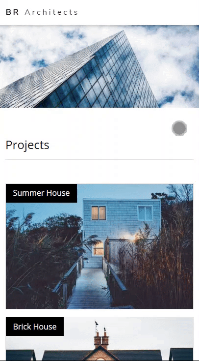
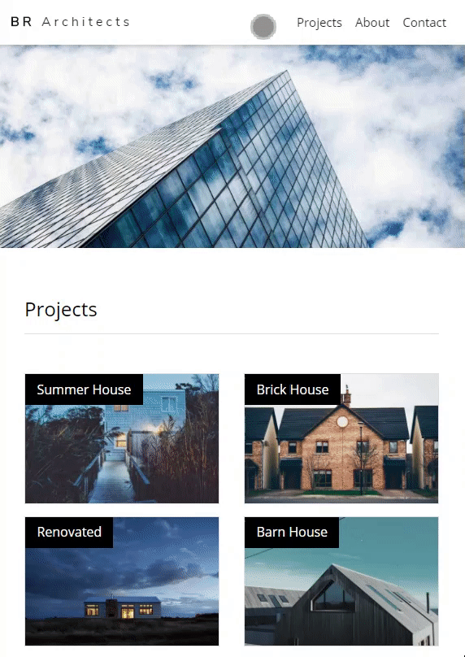

# BR Architects Web Project

This is BR Architects web project using Bootstrap technology. This web page was based on one of the W3Schools free templates availables.

## About
BR Architects is my personal project created to apply my Bootstrap knowledge.

### Tecnologies envolved
`bootstrap4` `jquery` `javascript`

### Website BR Architects
URL: https://tiagocbarbosa.github.io/brArchitects_web/html/index.html

### Characteristics
* It is responsive.
* It has fixed navbar on the top.  

  <kbd>

  
* The navbar nav links redirects the page to the Projects, About and Contact sections.  

  <kbd>

* The form submission and "tiagocbarbosa" (a A html tag in the botton of the page) will send the user to my GitHub profile.

------

And that's pretty much it, hope you liked it! Thanks :)
